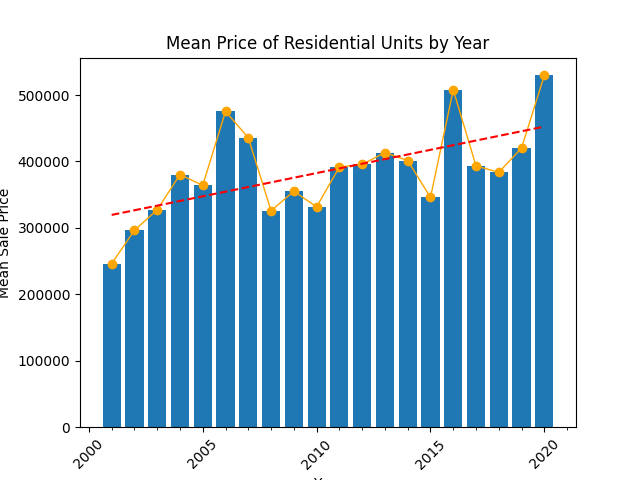
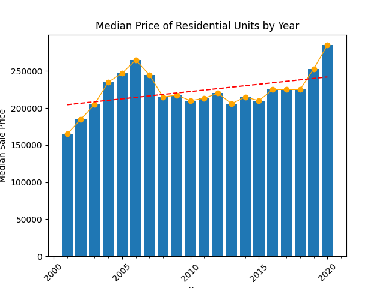
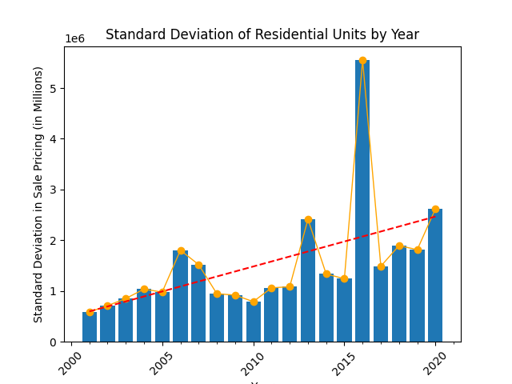
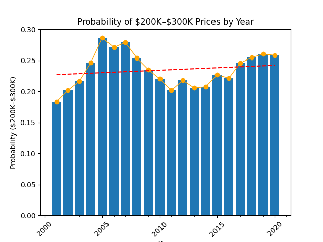

# Data Analysis of the Connecticut Housing Market
This project analyzes real-world data obtained from [Kaggle](https://www.kaggle.com/datasets/joebeachcapital/house-prices-2001-2020) listing housing prices in Connecticut between 2001 and 2020.

## Overview
- Analyzes sale pricing via statistical measurements such as mean and standard deviation.
- Demonstrates practical applications of data analysis and visualization.
- Showcases skills and concepts learned from Probability and Statistics course.


## What to Expect





## Getting Started

### If You're a Programmer... 
1. Download and unzip a copy of the code.
2. If you do not have python already installed on your computer, install a compatible version via https://www.python.org/downloads/.
3. Open your terminal or command prompt and navigate to the directory containing the unzipped python code: `cd Downloads/data-analysis-of-sales-main/`.
4. Create a virtual environment by running `python -m  venv venv`.
5. Activate your virtual environment.

    a. On Windows run: `.\venv\Scripts\activate`.

    b. On Linux run: `source venv/bin/activate`.

6. Run `pip install -r requirements.txt` to install the packages necessary to run the code.
7. Run `python ./main.py` and go through the data analytics displayed.

### If You're a Non-Programmer...
a. If you want to just view the code and its associated output, click on the `main.ipynb` file listed above.

b. Otherwise, if you want to run the code yourself, you can do so via [Google Collab](https://colab.research.google.com/github/tyreseGill/data-analysis-of-sales/blob/main/main.ipynb) (NOTE: You will need to be signed into a Google account to run).

## Repository Structure
```
├── .ipynb_checkpoints/
│
├── utils/                   # Contains helper functions for main.py
│   ├── __init__.py
│   ├── charts.py
|   ├── stats.py
|   └── tables.py
|
├── .gitignore
├── main.ipynb               # For non-programmers
├── main.py                  # For programmers
├── README.md                # (You're here 👋)
├── requirements.txt         # Shared dependencies
└── Sales_01_20.csv          # Data to be analyzed
```
